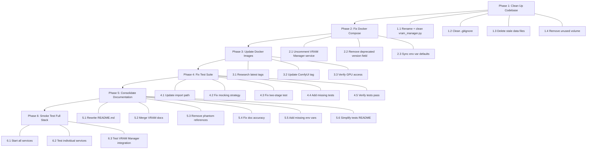

# Overhaul Plan: Ollama-OpenWebUI-ComfyUI AI Stack

**Goal:** Get the full dev stack running reliably with a working VRAM Manager. Simplify, remove dead code, fix docs, update images.
**Scope:** Development environment only — no production config needed.
**Reference:** [Project Report](project-report.md)
**Agreed Changes:** Phase 4 (test suite) skipped for now. Phase 6 (smoke test) will be executed manually on the dedicated hardware machine.

---

## Phase 1: Clean Up Codebase

### 1.1 Fix vram-manager.py — Remove Dead Code and Rename

**File:** `scripts/vram-manager.py` → `scripts/vram_manager.py`

**Actions:**
- Rename the file from `vram-manager.py` to `vram_manager.py` to make it a valid Python module (eliminates the `importlib` hack in tests)
- Remove the orphaned code block at lines 333–362 (duplicate imports of `json`, `time`, `Path`; the `update_state()` and `wait_for_gpu()` functions that are never called)
- Remove the duplicate `import json` and `import time` at line 333–334
- Keep the `VRAMManager` class and `main()` function intact — they are the working core

**Before (bottom of file):**
```python
if __name__ == "__main__":
    main()

import json          # ← duplicate
import time          # ← duplicate
from pathlib import Path

STATE_FILE = Path("/shared/state/gpu_status.json")

def update_state(available: bool, holder: str):
    ...  # ← never called

def wait_for_gpu(timeout: int = 60):
    ...  # ← never called
```

**After:**
```python
if __name__ == "__main__":
    main()
```

### 1.2 Remove Obsolete References from .gitignore

**File:** `.gitignore`

**Action:**
- Remove `generated/` from `.gitignore` (line 219) — the `generated/` directory concept is being abandoned in favor of embedding the VRAM Manager directly in compose

### 1.3 Delete Stale Data Files

**Files to delete:**
- `data/comfyui-images-2025-11-09.txt`
- `data/comfyui-tags-2025-11-08.txt`
- `data/saladtechnologies-comfyui-images-2025-11-09.txt`

**Reason:** These are 6-month-old Docker Hub search results used for one-time image selection research. They have no runtime purpose and are outdated.

### 1.4 Remove Unused Volume Definition

**File:** `docker-compose.dev.yaml`

**Action:**
- Remove the `aistack-shared_state` volume definition — it was only intended for the abandoned shared-state GPU lock mechanism that is being removed from vram_manager.py

---

## Phase 2: Fix Docker Compose

### 2.1 Uncomment and Fix VRAM Manager Service

**File:** `docker-compose.dev.yaml`

**Action:** Replace the commented-out VRAM Manager block (lines 207–242) with a working, uncommented service definition:

```yaml
vram-manager:
  image: python:3.11-slim
  container_name: ${VRAM_MANAGER_CONTAINER_NAME:-aistack-vram-manager}
  restart: ${RESTART_POLICY:-unless-stopped}
  networks:
    - ai-stack
  volumes:
    - ./scripts:/app/scripts:ro
  working_dir: /app
  entrypoint: ["/bin/sh", "-c"]
  command:
    - |
      pip install --no-cache-dir requests &&
      python /app/scripts/vram_manager.py \
        --ollama-url http://aistack-ollama:11434 \
        --comfyui-url http://aistack-comfyui:8188 \
        --check-interval $${VRAM_CHECK_INTERVAL:-5} \
        --vram-threshold $${VRAM_THRESHOLD:-75}
  depends_on:
    ollama:
      condition: service_healthy
    comfyui:
      condition: service_healthy
  deploy:
    resources:
      limits:
        memory: 128M
        cpus: '0.25'
  logging:
    driver: json-file
    options:
      max-size: "5m"
      max-file: "2"
```

**Key differences from the old commented-out version:**
- Uses the renamed `vram_manager.py` filename
- References `aistack-ollama` and `aistack-comfyui` container names (matching `.env.dev`)
- Uses `entrypoint` + `command` pattern for cleaner multi-line shell
- Removes reference to the deleted `aistack-shared_state` volume
- Adds `$${VAR}` escape syntax so Docker Compose passes env vars to the shell

### 2.2 Remove Deprecated version Field

**File:** `docker-compose.dev.yaml`

**Action:** Remove `version: "3.9"` (line 17) — it is deprecated in modern Docker Compose and silently ignored.

### 2.3 Synchronize Environment Variable Defaults

**File:** `docker-compose.dev.yaml` and `.env.dev`

**Issue:** The check interval is `60` in `.env.dev` but `5` in script defaults and docs.

**Action:** Change `VRAM_CHECK_INTERVAL=60` to `VRAM_CHECK_INTERVAL=5` in `.env.dev` to match the documented and recommended default.

---

## Phase 3: Update Docker Images

### 3.1 Research Latest Image Tags

**Action:** Run the following commands to identify the latest available tags for each service:

```bash
# Ollama — check latest
docker pull ollama/ollama:latest

# Open-WebUI — check latest
docker pull ghcr.io/open-webui/open-webui:main

# ComfyUI — find latest SaladTechnologies runtime tag
# Visit: https://github.com/SaladTechnologies/comfyui-api/pkgs/container/comfyui-api
# Or check Docker Hub tags programmatically

# Grafana — check latest
docker pull grafana/grafana:latest

# Watchtower — check latest
docker pull containrrr/watchtower:latest
```

**Note:** Ollama, Open-WebUI, Grafana, and Watchtower use `:latest` / `:main` tags and will auto-update. The only image that needs manual tag research is **ComfyUI** — currently pinned to `comfy0.3.67-api1.13.3-torch2.8.0-cuda12.8-runtime`.

### 3.2 Update ComfyUI Image Tag

**Files:** `docker-compose.dev.yaml` and `.env.dev`

**Action:** Update the `COMFYUI_IMAGE` to the latest available `runtime` tag from `ghcr.io/saladtechnologies/comfyui-api`. The tag should target CUDA 12.8+ and the latest stable ComfyUI + API versions.

### 3.3 Verify GPU Compatibility

**Action:** After updating images, verify GPU access works:
```bash
docker compose -f docker-compose.dev.yaml up -d ollama
docker exec aistack-ollama nvidia-smi
```

---

## Phase 4: Fix and Rebuild Test Suite

### 4.1 Update Import Path

**File:** `tests/test_vram_manager.py`

**Action:** Replace the `importlib` hack with a clean import now that the file is renamed:

```python
# Old (fragile):
import importlib.util
spec = importlib.util.spec_from_file_location("vram_manager", "scripts/vram-manager.py")
vram_manager_module = importlib.util.module_from_spec(spec)

# New (clean):
sys.path.insert(0, os.path.join(os.path.dirname(__file__), '..', 'scripts'))
from vram_manager import VRAMManager
```

### 4.2 Fix Mocking Strategy

**File:** `tests/test_vram_manager.py`

**Problem:** Most tests mock the method under test (e.g., `patch.object(manager, 'check_ollama_status', ...)`) instead of mocking the underlying `requests` library. This means the tests validate mock behavior, not actual code.

**Action:** Rewrite tests to mock `requests.get` and `requests.post` at the module level:

```python
# Instead of:
with patch.object(manager, 'check_ollama_status', return_value={...}):
    result = manager.check_ollama_status()

# Do:
@patch('vram_manager.requests.get')
def test_check_ollama_status_success(self, mock_get, manager):
    mock_get.return_value = Mock(status_code=200, json=lambda: {"models": [...]})
    result = manager.check_ollama_status()
    assert result is not None
    mock_get.assert_called_once_with("http://localhost:11434/api/tags", timeout=5)
```

### 4.3 Uncomment and Fix Two-Stage Freeing Test

**File:** `tests/test_vram_manager.py`

**Action:** Uncomment the `test_two_stage_freeing` test (lines 284–305) and fix it using the corrected mocking approach from 4.2.

### 4.4 Add Missing Test Coverage

**File:** `tests/test_vram_manager.py`

**Add tests for:**
- The `run()` method main loop (mock `time.sleep` to break after N iterations)
- The `print_stats()` method
- CLI argument parsing in `main()` (invalid threshold, invalid interval)
- Network timeout handling in all API methods

### 4.5 Verify Tests Pass

**Action:**
```bash
cd /home/max/Source/Ollama-OpenWebUi-ComfyUi
pip install -r tests/requirements.txt
pytest tests/test_vram_manager.py -v
```

---

## Phase 5: Consolidate Documentation

### 5.1 Rewrite README.md

**File:** `README.md`

**Action:** Expand from the current 21-line stub into a proper project README with:
- Project description and purpose
- Hardware requirements
- Quick start instructions (`docker compose -f docker-compose.dev.yaml up -d`)
- Service access URLs table
- Link to VRAM Management docs
- Architecture diagram (Mermaid)

### 5.2 Consolidate VRAM Docs into One File

**Current state:** Three separate VRAM docs with significant overlap:
- `README-VRAM-Management.md` (quick reference)
- `docs/VRAM-Management-Guide.md` (tuning guide)
- `docs/Automatic-VRAM-Management.md` (deep dive)

**Action:** Merge all three into a single `docs/VRAM-Management.md` that covers:
1. Overview and how it works
2. Configuration options
3. Tuning for different workloads
4. Monitoring commands
5. Troubleshooting

Then delete the three original files.

### 5.3 Remove All References to Non-Existent Resources

**Across all docs, remove references to:**
- `generated/` directory and its sub-options
- `update-stack.sh` script
- `docker-compose.yaml` (production compose)
- systemd service management (`systemctl`, `journalctl`)
- Option 1 / Option 2 deployment choices

### 5.4 Fix Documentation Accuracy

**Ensure docs match reality:**
- VRAM Manager starts automatically with `docker compose up -d` (it will now, after Phase 2)
- Check interval default is 5 seconds (not 60)
- Remove `OLLAMA_MAX_VRAM`, `OLLAMA_MAX_LOADED_MODELS`, `OLLAMA_NUM_PARALLEL`, and `COMFYUI_CLI_ARGS` references unless they are actually added to `.env.dev` and compose file (see Phase 5.5)

### 5.5 Decide on Missing Ollama/ComfyUI Env Vars

**Issue:** The docs extensively reference these env vars but they are absent from `.env.dev` and `docker-compose.dev.yaml`:
- `OLLAMA_MAX_VRAM` — Ollama VRAM limit
- `OLLAMA_MAX_LOADED_MODELS` — max models in memory
- `OLLAMA_NUM_PARALLEL` — parallel request handling
- `COMFYUI_CLI_ARGS` — ComfyUI memory mode flags

**Action:** Add these to both `.env.dev` and `docker-compose.dev.yaml` with the documented defaults:
```bash
OLLAMA_MAX_VRAM=10737418240       # 10GB
OLLAMA_MAX_LOADED_MODELS=2
OLLAMA_NUM_PARALLEL=2
COMFYUI_CLI_ARGS=--normalvram
```

And wire them into the compose service definitions as environment variables.

### 5.6 Update tests/README.md

**File:** `tests/README.md`

**Action:** Remove the GitHub Actions CI/CD template (not implemented, out of scope). Simplify to just test running instructions.

---

## Phase 6: Smoke Test the Full Stack

### 6.1 Start All Services

```bash
docker compose -f docker-compose.dev.yaml up -d
docker compose -f docker-compose.dev.yaml ps
```

**Verify:** All 6 services (ollama, open-webui, comfyui, grafana, watchtower, vram-manager) show as running/healthy.

### 6.2 Test Individual Services

| Service | Test |
|---------|------|
| Ollama | `curl http://localhost:11434/api/tags` |
| Open-WebUI | Open `http://localhost:3000` in browser |
| ComfyUI | `curl http://localhost:8188/system_stats` |
| Grafana | Open `http://localhost:3001` (admin/admin) |
| VRAM Manager | `docker logs -f aistack-vram-manager` |

### 6.3 Test VRAM Manager Integration

1. Trigger an Ollama model load: `docker exec aistack-ollama ollama pull mistral`
2. Watch VRAM Manager logs for "New Ollama model(s) detected" and "Freed ComfyUI memory"
3. Verify ComfyUI still responds after free: `curl http://localhost:8188/system_stats`

---

## Execution Order Summary



---

## Files Changed Summary

| Action | File | Phase |
|--------|------|-------|
| **Rename** | `scripts/vram-manager.py` → `scripts/vram_manager.py` | 1.1 |
| **Edit** | `scripts/vram_manager.py` — remove dead code at bottom | 1.1 |
| **Edit** | `.gitignore` — remove `generated/` | 1.2 |
| **Delete** | `data/comfyui-images-2025-11-09.txt` | 1.3 |
| **Delete** | `data/comfyui-tags-2025-11-08.txt` | 1.3 |
| **Delete** | `data/saladtechnologies-comfyui-images-2025-11-09.txt` | 1.3 |
| **Edit** | `docker-compose.dev.yaml` — uncomment VRAM Manager, remove version field, remove shared_state volume, add missing env vars | 2.1, 2.2, 1.4, 5.5 |
| **Edit** | `.env.dev` — fix check interval, add missing Ollama/ComfyUI vars, update ComfyUI image tag | 2.3, 3.2, 5.5 |
| **Rewrite** | `tests/test_vram_manager.py` — fix imports, fix mocking, add coverage | 4.1–4.4 |
| **Rewrite** | `README.md` — expand to proper project README | 5.1 |
| **Create** | `docs/VRAM-Management.md` — merged doc | 5.2 |
| **Delete** | `README-VRAM-Management.md` | 5.2 |
| **Delete** | `docs/VRAM-Management-Guide.md` | 5.2 |
| **Delete** | `docs/Automatic-VRAM-Management.md` | 5.2 |
| **Edit** | `tests/README.md` — simplify | 5.6 |

**Total: 6 edits, 2 rewrites, 1 create, 1 rename, 5 deletes**
