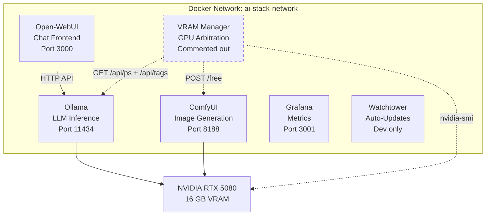
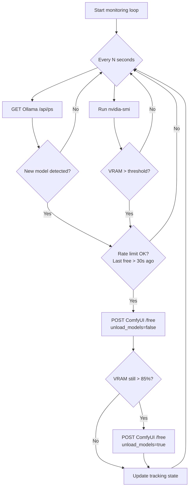

# Project Report: Ollama-OpenWebUI-ComfyUI AI Stack

**Date:** 2026-04-11  
**Status:** Abandoned / Development Stalled (~November 2025)  
**Author:** maxron84 (with AI-assisted content generation)

---

## 1. Executive Summary

This project is a **self-hosted, single-GPU AI inference stack** orchestrated via Docker Compose. It bundles a large language model (LLM) backend (Ollama), a chat frontend (Open-WebUI), an image/video/audio generation backend (ComfyUI), monitoring (Grafana), automatic container updates (Watchtower), and a custom Python-based VRAM Manager for dynamic GPU memory arbitration between the two GPU-hungry services.

The project was authored around **October–November 2025**, targeting an NVIDIA RTX 5080 (16 GB VRAM) workstation. It reached a functional development-stage configuration but was **never promoted to production**. The VRAM Manager Docker service, the project's most novel component, is **commented out** in the compose file and references a `generated/` directory (for Dockerfile-based and no-build deployment options) that is **gitignored and absent from the repository**.

---

## 2. Target Hardware

Documented in [`README.md`](README.md):

| Component | Specification |
|-----------|--------------|
| GPU | Palit GeForce RTX 5080 (16 GB VRAM) |
| CPU | AMD Ryzen 7 9800X3D |
| RAM | 64 GB DDR5-6000 |
| Storage | 2 TB M.2 SSD PCIe 4.0 |
| Motherboard | MSI X870E |
| PSU | 1000 W |

This is a high-end consumer/prosumer workstation — not a server rack. The single-GPU constraint is the central driver behind the VRAM Manager design.

---

## 3. Architecture Overview

### 3.1 Service Inventory

| Service | Image | Purpose | GPU Access |
|---------|-------|---------|------------|
| **Ollama** | `ollama/ollama:latest` | LLM inference engine | Yes — all GPUs |
| **Open-WebUI** | `ghcr.io/open-webui/open-webui:main` | Web chat frontend for Ollama | No |
| **ComfyUI** | `ghcr.io/saladtechnologies/comfyui-api:comfy0.3.67-api1.13.3-torch2.8.0-cuda12.8-runtime` | Stable Diffusion image/video/audio generation | Yes — all GPUs |
| **Grafana** | `grafana/grafana:latest` | Metrics visualization | No |
| **Watchtower** | `containrrr/watchtower:latest` | Automatic Docker image updates (dev only) | No |
| **VRAM Manager** | `python:3.11-slim` (commented out) | Dynamic VRAM arbitration between Ollama and ComfyUI | No (uses nvidia-smi via subprocess) |

### 3.2 Networking

All services share a single bridge network named `ai-stack-network`. Inter-service communication uses Docker DNS hostnames (e.g., `http://aistack-ollama:11434`).

### 3.3 Volumes

Five named Docker volumes provide persistent storage:

| Volume | Mounted To | Purpose |
|--------|-----------|---------|
| `aistack-ollama_data` | `/root/.ollama` | Downloaded LLM models |
| `aistack-open_webui_data` | `/app/backend/data` | Chat history, user data |
| `aistack-comfyui_data` | `/root/.comfyui` | ComfyUI configuration |
| `aistack-grafana_data` | `/var/lib/grafana` | Dashboards, data sources |
| `aistack-shared_state` | `/shared/state` (VRAM Manager) | GPU lock-file state (unused) |

ComfyUI additionally bind-mounts three host directories for models, workflows, and custom nodes under `./data/comfyui/`.

---

## 4. Configuration System

The project uses a single environment file ([`.env.dev`](.env.dev)) with the `docker-compose.dev.yaml` compose file. All service parameters are configurable via environment variables with sensible defaults baked into the compose file's `${VAR:-default}` syntax.

### 4.1 Key Configuration Categories

- **Global:** restart policy (`always` for dev)
- **Ollama:** image, container name, port, host binding, CORS origins
- **Open-WebUI:** image, port, secret key, auth toggle, display name
- **ComfyUI:** image (pinned SaladTechnologies tag), ports
- **Watchtower:** cleanup, schedule (`3 AM daily`), notification hooks
- **Grafana:** image, port, admin credentials (`admin/admin` for dev), plugins
- **VRAM Manager:** container name, check interval (60s in env, 5s in script default), threshold (75%), debug flag

### 4.2 Production vs Development

The README and env file reference a production compose file (`docker-compose.yaml`) and an `update-stack.sh` script, but **neither file exists in the repository**. The project never reached the production configuration stage.

---

## 5. The VRAM Manager — Core Innovation

The most substantial custom code in the project is the VRAM Manager ([`scripts/vram-manager.py`](scripts/vram-manager.py:1)), a ~360-line Python script that solves the **single-GPU contention problem** between Ollama and ComfyUI.

### 5.1 Problem Statement

When both Ollama and ComfyUI compete for the same 16 GB of VRAM:
- Ollama may **fall back to CPU inference** (100x slower) if insufficient VRAM is available when loading a new model.
- ComfyUI may hit **CUDA out-of-memory** errors during image generation.
- Neither service has built-in awareness of the other.

### 5.2 Solution Design

The [`VRAMManager`](scripts/vram-manager.py:44) class implements a polling-based monitor:

**Key mechanisms:**

1. **Model Detection:** Polls [`Ollama /api/ps`](scripts/vram-manager.py:89) to track loaded models. When a new model name appears (set difference), triggers a free.
2. **VRAM Threshold:** Calls [`nvidia-smi`](scripts/vram-manager.py:139) to check GPU memory percentage. Triggers when above configurable threshold (default 75%).
3. **Two-Stage Freeing:** First attempts a soft free (cache only) via ComfyUI's [`/free`](scripts/vram-manager.py:111) API. If VRAM remains above 85%, escalates to aggressive free (unloads models).
4. **Rate Limiting:** Minimum 30 seconds between frees to prevent thrashing.
5. **Statistics Tracking:** Counts model loads, frees, and errors; prints summary on shutdown.

### 5.3 Shared State Extension

At the bottom of [`vram-manager.py`](scripts/vram-manager.py:333) there is a secondary, **disconnected code block** (lines 333–362) that implements a file-based GPU state lock via `/shared/state/gpu_status.json`. This includes:
- [`update_state()`](scripts/vram-manager.py:339) — writes JSON with `gpu_available`, `holder`, and `last_updated`
- [`wait_for_gpu()`](scripts/vram-manager.py:349) — polls the state file with a timeout

This code is **not integrated** into the `VRAMManager` class or the `main()` function. It appears to be an **exploratory prototype** for a more sophisticated GPU locking mechanism that was never completed. The corresponding `aistack-shared_state` Docker volume is defined in the compose file but unused.

### 5.4 Deployment Status

The VRAM Manager service definition in [`docker-compose.dev.yaml`](docker-compose.dev.yaml:207) is **entirely commented out** (lines 207–242). The documentation references two deployment options in a `generated/` directory:
- **Option 1:** Dockerfile-based (production) — `generated/option1-dockerfile/`
- **Option 2:** No-build (development) — `generated/option2-no-build/`

However, `generated/` is listed in [`.gitignore`](.gitignore:219) and the directory does not exist in the repository. This means the containerized deployment of the VRAM Manager was **never committed or was deliberately excluded**.

---

## 6. Supporting Scripts

### 6.1 install-missing-libs.sh

[`scripts/install-missing-libs.sh`](scripts/install-missing-libs.sh:1) is a small utility script for manually installing missing system libraries inside the running ComfyUI container:
- `build-essential` — C compiler toolchain
- `libsamplerate0-dev` — audio resampling library
- `portaudio19-dev` — audio I/O library
- `ffmpeg` — multimedia framework

This suggests the project was experimenting with **audio-related ComfyUI workflows** (e.g., audio generation or processing custom nodes).

---

## 7. Test Suite

### 7.1 Structure

The test suite ([`tests/test_vram_manager.py`](tests/test_vram_manager.py:1)) contains three test classes targeting the VRAM Manager:

| Class | Focus | Test Count |
|-------|-------|-----------|
| [`TestVRAMManager`](tests/test_vram_manager.py:27) | Unit tests — individual methods in isolation | 10 |
| [`TestVRAMManagerIntegration`](tests/test_vram_manager.py:166) | Integration — multi-step workflows | 4 |
| [`TestVRAMManagerEdgeCases`](tests/test_vram_manager.py:241) | Boundary conditions and edge cases | 4 |

### 7.2 Quality Assessment

**Strengths:**
- Good coverage of the decision logic ([`should_free_comfyui()`](scripts/vram-manager.py:163))
- Tests for threshold boundary conditions (exactly at vs. slightly above)
- Rate-limiting verification
- nvidia-smi subprocess mocking

**Weaknesses:**
- Most unit tests mock the method under test itself (e.g., `patch.object(manager, 'check_ollama_status', ...)`) rather than mocking the underlying `requests` library — this tests the mock, not the actual code
- The two-stage freeing test is **commented out with a TODO** indicating mocking issues (line 283)
- No test covers the `run()` main loop
- No test covers the `print_stats()` method
- The orphaned `update_state()` / `wait_for_gpu()` functions have zero test coverage
- Module loading uses a fragile `importlib` hack due to the hyphenated filename `vram-manager.py`

### 7.3 Dependencies

From [`tests/requirements.txt`](tests/requirements.txt:1):
- `pytest>=7.4.0`
- `pytest-mock>=3.12.0`
- `pytest-cov>=4.1.0`
- `requests>=2.31.0`

---

## 8. Documentation

The project has extensive documentation, though much of it is **aspirational** (describing intended behavior of features not yet fully deployed):

| Document | Purpose | Notes |
|----------|---------|-------|
| [`README.md`](README.md) | Project overview, hardware specs | Minimal — 21 lines |
| [`README-VRAM-Management.md`](README-VRAM-Management.md) | VRAM management quick reference | References non-existent `generated/` directory |
| [`docs/VRAM-Management-Guide.md`](docs/VRAM-Management-Guide.md) | Comprehensive tuning guide | Mixes Docker and systemd instructions inconsistently |
| [`docs/Automatic-VRAM-Management.md`](docs/Automatic-VRAM-Management.md) | Deep-dive into VRAM Manager | References non-existent deployment options |
| [`tests/README.md`](tests/README.md) | Test suite documentation | Includes CI/CD template (not implemented) |

### 8.1 Documentation Inconsistencies

- Several docs reference **systemd service management** (`sudo systemctl start vram-manager`) while the project is Docker-only
- The `OLLAMA_MAX_VRAM`, `OLLAMA_MAX_LOADED_MODELS`, `OLLAMA_NUM_PARALLEL`, and `COMFYUI_CLI_ARGS` environment variables are documented in guides but **not present** in [`.env.dev`](.env.dev) or [`docker-compose.dev.yaml`](docker-compose.dev.yaml)
- The `generated/` directory is referenced in multiple docs but does not exist
- Documentation states the VRAM Manager is "integrated into docker-compose.dev.yaml and starts automatically" — it is actually commented out
- The check interval is `60` in `.env.dev` but `5` in the script defaults and most documentation

---

## 9. Data Files

The [`data/`](data/) directory contains research artifacts from **November 2025**:

| File | Content |
|------|---------|
| [`comfyui-images-2025-11-09.txt`](data/comfyui-images-2025-11-09.txt) | Docker Hub search results for ComfyUI images (26 results) |
| [`comfyui-tags-2025-11-08.txt`](data/comfyui-tags-2025-11-08.txt) | Available tags for SaladTechnologies ComfyUI image (100 tags) |
| [`saladtechnologies-comfyui-images-2025-11-09.txt`](data/saladtechnologies-comfyui-images-2025-11-09.txt) | Broader Docker Hub search for ComfyUI-related images (26 results) |

These files document the **image selection research process** that led to choosing `ghcr.io/saladtechnologies/comfyui-api` as the ComfyUI image. The chosen tag (`comfy0.3.67-api1.13.3-torch2.8.0-cuda12.8-runtime`) is notably **newer** than anything in the tag list file (which maxes out at `comfy0.3.61`), suggesting the image was updated after the research was done, or the tag was obtained from GHCR rather than Docker Hub.

---

## 10. Code Quality Observations

### 10.1 Positive Aspects
- Clean Docker Compose structure with thorough comments
- All magic values extracted to environment variables with defaults
- Healthchecks on all major services
- Logging configuration on all containers (json-file driver with rotation)
- Resource limits on non-GPU services (Watchtower: 256M/0.5 CPU; Grafana: 4G/2 CPU)
- The VRAM Manager script is well-structured with a clear class hierarchy

### 10.2 Issues and Technical Debt

1. **Duplicate imports in vram-manager.py:** `json` and `time` are imported twice — once at the top (line 33–34) and again at line 333–334 after `main()`. The second import block is part of the orphaned shared-state code.

2. **Dead code:** The [`update_state()`](scripts/vram-manager.py:339) and [`wait_for_gpu()`](scripts/vram-manager.py:349) functions at the bottom of `vram-manager.py` are unreachable and untested.

3. **Compose version field:** `version: "3.9"` in the compose file is [deprecated](https://docs.docker.com/reference/compose-file/version-and-name/) in modern Docker Compose and is silently ignored.

4. **No GPU isolation:** Both Ollama and ComfyUI reserve `count: all` GPUs. On this single-GPU system that is fine, but there is no MIG or MPS partitioning — VRAM contention is managed purely at the application level via the VRAM Manager.

5. **Security in dev mode:** Wide-open CORS (`OLLAMA_ORIGINS=*`), default credentials (`admin/admin`), and a weak secret key (`dev-secret-key-change-for-production`) are documented as dev-only but there is no production config to switch to.

6. **Hyphenated Python filename:** `vram-manager.py` cannot be imported as a regular Python module, requiring the `importlib` workaround in tests.

---

## 11. What Was Completed vs. What Was Planned

| Component | Status | Evidence |
|-----------|--------|----------|
| Docker Compose for core services | ✅ Complete | Functional dev compose file |
| Environment configuration | ✅ Complete | Comprehensive `.env.dev` |
| Ollama + Open-WebUI integration | ✅ Complete | Proper `depends_on` with healthcheck |
| ComfyUI containerization | ✅ Complete | With bind mounts for models/workflows |
| Grafana setup | ⚠️ Partial | Container configured but no dashboards/data sources provisioned |
| Watchtower auto-updates | ✅ Complete | Dev-only, with schedule configuration |
| VRAM Manager script | ⚠️ Partial | Core logic complete, shared-state extension incomplete |
| VRAM Manager Docker deployment | ❌ Incomplete | Commented out in compose; `generated/` directory missing |
| VRAM Manager Dockerfile | ❌ Missing | Referenced but not in repository |
| Production compose file | ❌ Missing | Referenced in docs but absent |
| Production env file | ❌ Missing | No `.env.prod` or equivalent |
| Update script | ❌ Missing | `update-stack.sh` referenced but absent |
| Unit tests | ⚠️ Partial | Exist but have mocking issues and low effective coverage |
| CI/CD pipeline | ❌ Missing | Template in test README but not implemented |
| Audio workflow support | ⚠️ Exploratory | Install script exists for audio libs |

---

## 12. Risk Assessment for Resumption

If this project were to be resumed, the following areas need attention:

### 12.1 High Priority
- **Stale Docker images:** The pinned ComfyUI image tag is from ~November 2025. ComfyUI, Ollama, and their ecosystems have likely had significant updates.
- **VRAM Manager integration:** The commented-out service and missing `generated/` files need to be rebuilt or the approach reconsidered.
- **Dead code cleanup:** Remove or integrate the orphaned shared-state code block.

### 12.2 Medium Priority
- **Test suite repair:** Fix the mocking strategy so tests exercise actual code rather than mocked versions of themselves.
- **Rename `vram-manager.py` to `vram_manager.py`:** Eliminate the `importlib` hack.
- **Remove `version: "3.9"`** from compose file.
- **Reconcile documentation:** Fix references to non-existent files and resolve systemd vs. Docker inconsistencies.

### 12.3 Low Priority
- **Grafana provisioning:** Add data sources and dashboards for GPU/container metrics.
- **Production configuration:** Create the production compose file, env file, and update script.
- **CI/CD:** Implement the GitHub Actions pipeline described in the test README.

---

## 13. Summary

This project represents a **well-conceived but incomplete** attempt to build a self-hosted AI workstation stack with intelligent GPU memory management. The core Docker Compose setup for Ollama, Open-WebUI, ComfyUI, Grafana, and Watchtower is functional. The VRAM Manager — the project's distinguishing feature — has a solid design with a two-stage freeing strategy, rate limiting, and threshold-based triggering, but its containerized deployment was never finalized.

The project was abandoned at a point where the development environment worked but production readiness, proper testing, and full VRAM Manager integration remained outstanding. The extensive documentation, while sometimes aspirational, provides a good roadmap for what was intended.

**Estimated overall completion: ~55–60%** of the originally envisioned scope.
